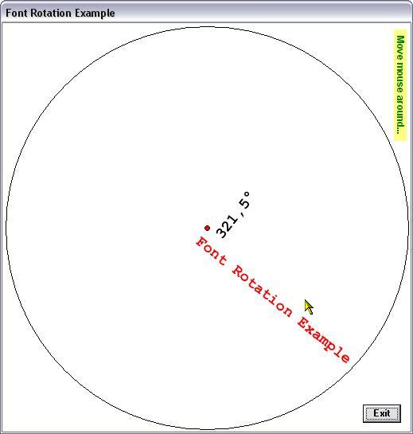



## Font Rotation

### Description

Little class and demo showing how to rotate fonts.
 
### More Info
 

             |
---                |---
**Submitted On**   |2007-02-16 23:04:54
**By**             |[ULLI](https://github.com/Planet-Source-Code/PSCIndex/blob/master/ByAuthor/ulli.md)
**Level**          |Intermediate
**User Rating**    |5.0 (55 globes from 11 users)
**Compatibility**  |VB 6\.0
**Category**       |[Graphics](https://github.com/Planet-Source-Code/PSCIndex/blob/master/ByCategory/graphics__1-46.md)
**World**          |[Visual Basic](https://github.com/Planet-Source-Code/PSCIndex/blob/master/ByWorld/visual-basic.md)
**Archive File**   |[Font\_Rotat2048452172007\.zip](https://github.com/Planet-Source-Code/ulli-font-rotation__1-67896/archive/master.zip)

